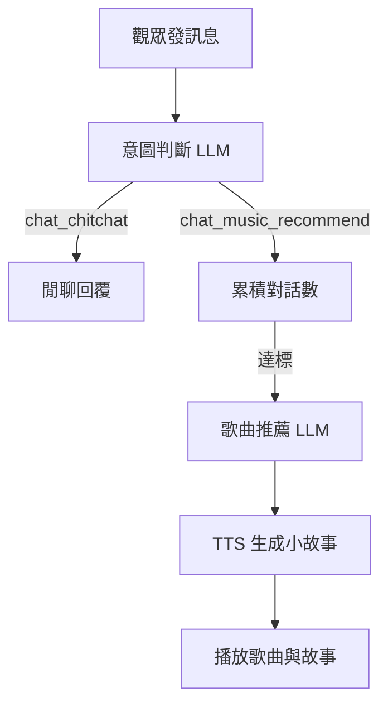

# 🎵 Jarvis - Twitch 音樂聊天機器人

> 一個能陪你聊天、唱歌、並依照對話推薦歌曲的 **深夜電台風格** Twitch Bot。

---

## 📌 功能特色

- **Twitch 即時互動**  
  - 監聽直播聊天室訊息  
  - 支援自訂指令（`!hi`、`!rules`、`!Jarvis` 等）

- **多情境聊天**  
  - 閒聊 (`chat_chitchat`)  
  - 聊到一定次數後自動推薦歌曲 (`chat_music_recommend`)  
  - 提供使用規則與操作說明

- **智慧歌曲推薦** 🎤  
  - 使用 OpenAI LLM 分析最近聊天內容  
  - 從資料庫歌曲清單中選出最合適的歌  
  - 自動生成推薦理由與溫暖的深夜小故事（6–10 句）

- **語音播放 (TTS)**  
  - 呼叫本地 VITS API 或 Google TTS  
  - 以真實主播口吻播放故事與歌曲介紹  
  - 即時更新字幕檔案 `subtitle.txt`

- **音樂播放與管理**  
  - 從資料庫取得歌曲檔案路徑  
  - 用 `pydub` 播放音檔  
  - 任務佇列管理（聊天 / 自動播歌 / 推薦歌曲）

- **YouTube 歌曲處理**  
  - 接收觀眾提供的 YouTube 連結  
  - 用 `yt_dlp` 抓取標題或下載 MP3  
  - 自動儲存到資料庫

---

## 📂 專案結構

```
readChat.py       # 主程式（Twitch 聊天 + 歌曲推薦 + 播放）
config.py         # 設定檔（API 金鑰、資料庫路徑等）
requirements.txt  # 依賴套件
music/            # 音樂檔案
tts/              # TTS 語音檔案
db.sqlite3        # SQLite 資料庫
```

---

## ⚙️ 安裝與使用

### 1️⃣ 安裝依賴
```bash
pip install -r requirements.txt
```

### 2️⃣ 設定環境
在 `config.py` 中設定：
```python
CLIENT_ID = "Twitch Client ID"
CLIENT_SECRET = "Twitch Client Secret"
BOT_ID = "Bot User ID"
OWNER_ID = "Your Twitch User ID"
OPENAI_API_KEY = "Your OpenAI API Key"
OPENAI_MODEL_NAME = "gpt-4o-mini"
DB_PATH = "./db.sqlite3"
MUSIC_PATH = "./music"
TTS_PATH = "./tts"
DL_PATH = "./downloads"
WORKING_PATH = "./"
```

### 3️⃣ 執行
```bash
python readChat.py
```

---

## 🖼️ 系統流程圖


---

## 💡 主要技術
- **Twitch 聊天串接**：`twitchio`
- **語音播放**：`pydub` + `simpleaudio`
- **語音合成**：本地 VITS API / `gTTS`
- **AI 模型**：`langchain` + `ChatOpenAI`
- **資料庫**：`sqlite3`
- **YouTube 處理**：`yt_dlp`

---

## 📝 授權
MIT License

---

如果你覺得這個專案有趣，記得 ⭐ **Star** 一下！
